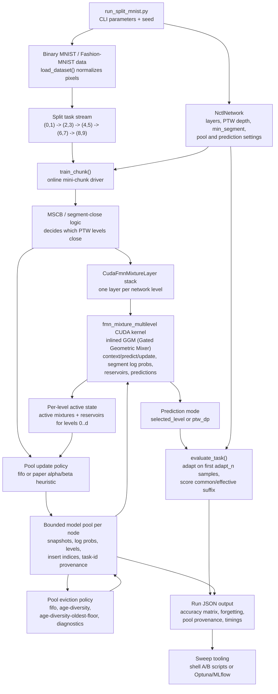
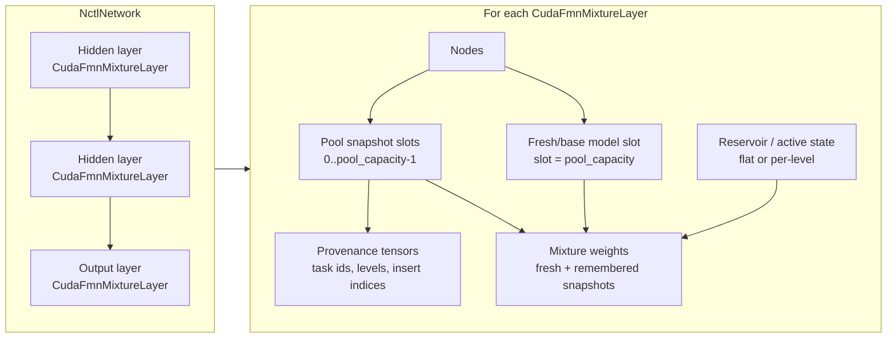
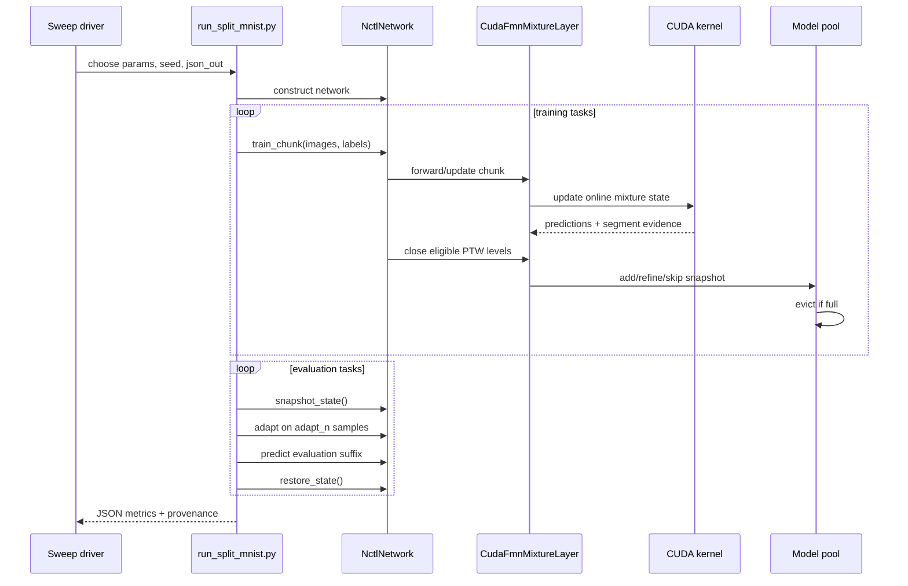

# Neural Combinatorial Transfer Learning (NCTL) Architecture

This document sketches the GPU Neural Combinatorial Transfer Learning (NCTL)
Split-MNIST benchmark architecture.  It is intended as a quick map for future
hyperparameter searches and implementation work; see
`docs/nctl-parameter-reference.md` for the full parameter inventory.

## End-to-End Flow

## Layer and Pool Structure

## Control Loops

## Architectural Notes

- `NctlNetwork` owns the layer stack, task-independent PTW/segment scheduling,
  and the evaluation-facing prediction path.
- `CudaFmnMixtureLayer` owns per-node hyperplanes, active mixture state,
  bounded pools, pool metadata, and provenance counters.
- The multilevel CUDA kernel performs the hot per-sample work, including
  Gated Geometric Mixer (GGM) context selection, prediction, and online weight
  update inlined inside the FMN mixture kernel. Python handles sparse boundary
  bookkeeping, pool admission, eviction, and JSON summaries.
- `active_state=per-level` plus `prediction_mode=ptw_dp` is the current
  paper-fidelity path because it gives every retained PTW level independent
  active state and mixes predictions with the Algorithm 1 dynamic program.
- Pool retention is the main lever for closing the Split-MNIST paper gap.
  Task-free policies should use insertion indices and other benchmark-agnostic
  metadata; `task-floor` is diagnostic because it consumes task IDs.
